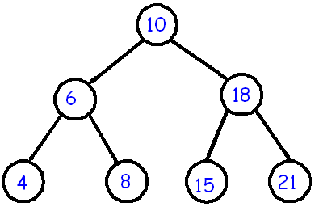

# WhiteBoxTesting

Creators : BANDARA VINURI , ESLAMI YALDA , add your name>

Specification by : DA SILVA NERI MARQUES CARVALHO RICARDO FILIPE , MARTINS ROMAO JOAO DIOGO

    
<h1 id="m_Specification-of-program-“bst”"><a class="m_anchor m_hidden-xs" title="Specification-of-program-“bst”" rel="noreferrer"></a>Specification of program “bst”</h1><h2 id="m_Name"><a class="m_anchor m_hidden-xs" title="Name" rel="noreferrer"></a>Name</h2>
bst - Verifies if a provided list of numbers represent a valid binary search tree.
<h2 id="m_Usage"><a class="m_anchor m_hidden-xs" title="Usage" rel="noreferrer"></a>Usage</h2>
bst input-file [options]
<h2 id="m_Description"><a class="m_anchor m_hidden-xs" title="Description" rel="noreferrer"></a>Description</h2>
<strong>bst</strong> reads a <strong>list of integers</strong> from an input file and verifies a if the provided <strong>integer</strong> values build a valid <a href="https://www.google.com/url?q=https://en.wikipedia.org/wiki/Binary_search_tree&amp;source=gmail-html&amp;ust=1668091938013000&amp;usg=AOvVaw0oIpC0dT9Y36usu6c0pSZR" rel="noopener noreferrer" target="_blank">binary search tree</a> (BST) when visited following a <a href="https://www.google.com/url?q=https://en.wikipedia.org/wiki/Breadth-first_search&amp;source=gmail-html&amp;ust=1668091938013000&amp;usg=AOvVaw0Fvz3_xfurTNKylJWiVwCb" rel="noopener noreferrer" target="_blank">breadth-first search</a>. The result tree is printed with each level in a different line.

 
The presented tree, which is a valid BST, would be represented by the following input string: <code>10 6 18 4 8 15 21</code>

 
On the other hand, this image, that would be represented by <code>1 2 3 4 5 6 7</code>, does not represent a valid BST

The program should visit this string provided in a text file and print <code>valid</code> or <code>invalid</code>.

Tree representation follows this logic: 

<h2 id="m_Options"><a class="m_anchor m_hidden-xs" title="Options" rel="noreferrer"></a>Options</h2>
Options should be provided through the command line.
<ul>
<li><code>-f[ile] &lt;filename&gt;</code> - redirect the program output to the specified file.</li>
</ul>
The options below should only be executed if the given tree is a valid binary search tree. Each operation should print the result in a new line. Each presented expected output takes the valid BST image shown in the <code>Description</code> as reference.
<ul>
<li><code>-t[op]</code> - prints the top view of the tree. Expected output <code>4 6 10 18 21</code></li>
<li><code>-b[ottom]</code> - prints the bottom view of the tree. <code>4 8 15 21</code></li>
<li><code>-r[ight]</code> - prints the right side view of the tree. <code>10 18 21</code></li>
<li><code>-l[eft]</code> - prints the left side view of the tree. <code>10 6 4</code></li>
<li><code>-d[iameter]</code> - prints the diameter of the tree. Expected output (one of the following):
<ul>
<li><code>4 6 10 18 21</code></li>
<li><code>4 6 10 18 15</code></li>
<li><code>8 6 10 18 21</code></li>
<li><code>8 6 10 18 15</code></li>
</ul>
</li>
<li><code>-h[eight]</code> - prints the height of the tree. Expected output <code>3</code></li>
</ul><h2 id="m_Input-Data"><a class="m_anchor m_hidden-xs" title="Input-Data" rel="noreferrer"></a>Input Data</h2><ul>
<li>File containing a <strong>list of integers</strong> (the string provided in the input file must not contain floating point numbers or anything that isn’t an integer) separated by a space.</li>
<li>No number must exceed 10000.</li>
<li>The provided binary tree must be <strong>complete</strong> (every parent node has 2 and only 2 children nodes). In complete binary trees the number of elements equals to <code>2^h – 1</code> where <code>h</code> is the height of the tree. The tree should not have a height superior to 10, meaning that the number of provided elements should not exceed 1023 (2^10 - 1).</li>
</ul><h2 id="m_Limitations"><a class="m_anchor m_hidden-xs" title="Limitations" rel="noreferrer"></a>Limitations</h2><ul>
<li>The commands that are passed on the command line must be the same as in the specification, or the program will not function correctly.</li>
</ul>

    

<h2> Implementation </h2>

Vinuri - Implemented the basic functionalities

To Do 
<ul>
<li> Arguments should be integers, no floats etc</li>
<li>Check argument validity</li>
<li>File not found error</li>
<li>Check input validity - each node should be less than x</li>
<li>Check if the binary tree is complete using the height and the number of elements</li>
</ul>

